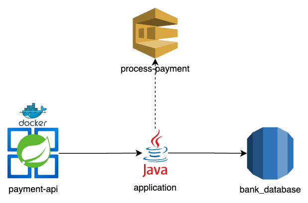

# Projeto de pagamentos de empréstimos

Este projeto configura um sistema de pagamentos de empréstimos, onde é possível atualizar um empréstimo para PAGO.

## Conteúdo

- **Loan API**: Aplicação em Java 21 e SpringBoot.
- [**Arquitetura**](#arquitetura)

## Pré-requisitos

- Docker
- Docker Compose
- [IAC](https://github.com/sjsistemasltda/bank_iac)
- Maven (Opcional para rodar os testes sem IDE)

## Como usar

1. **Clone o repositório**:
   ```sh
   git clone https://github.com/sjsistemasltda/loan
   cd loan

2. **Faça o build do docker**:
    ```sh
    docker-compose build;

3. **Inicie o container**:
    ```sh
    docker-compose up -d;

4. **Serviços em funcionamento**:
- Loan API: http://localhost:8082
- Actuator: http://localhost:8082/actuator/health

## Execução de testes unitários
   ```sh
   mvn test -Dspring.profiles.active=local
   ```

## cURLs de exemplo

**Pagar um empréstimo**:
```sh
curl --request POST \
  --url http://localhost:8082/v1/payments/{loanId}/pay \
  --header 'Content-Type: application/json' \
  --data '{}'
```

## Arquitetura
